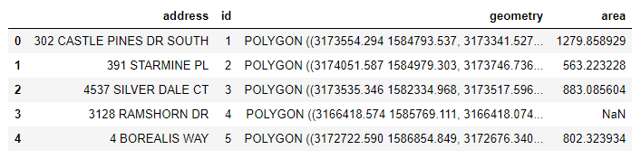
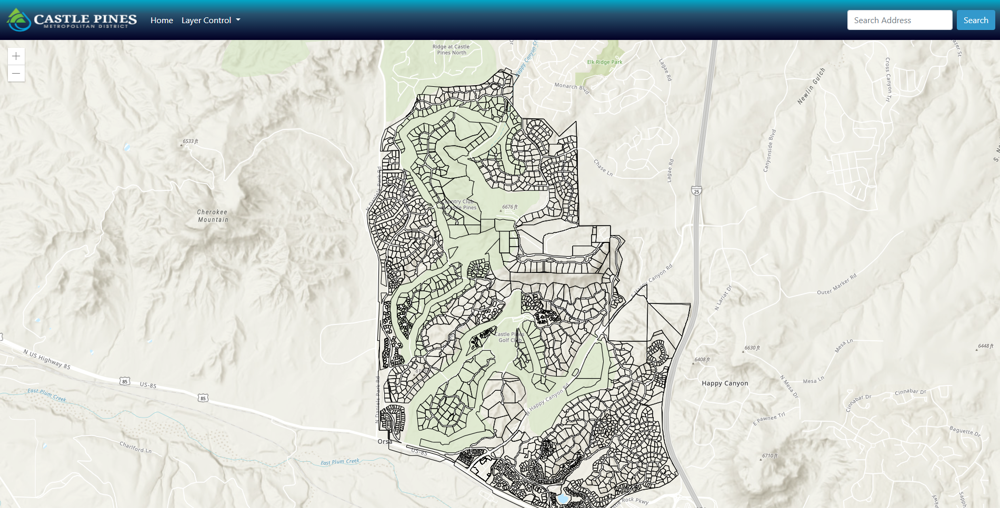

# Metropolitan Landcover Classification
## A Case Study of Castle Pines Metropolitan District

## I. Introduction
The Denver Metro Area is slowly inching towards a water crisis.  Years of drought and overuse of water have led many municipalities and water districts scrambling to find ways to alleviate water usage beyond tiered pricing structures.  The obvious first choice is to educate homeowners and assist them in creating water budgets for landscape irrigation.  Areas of native grasses need significantly less water than turf, yet many homeowners are wasting thousands of gallons a year watering native grass for aesthetic purposes or out of ignorance.  To educate homeowners and create water budgets vegetation classification is needed, but many municipalities/metro districts do not have the finances, or manpower to survey properties accurately and need a semi-automated approach.  

Utilizing Object Based Imagery Analysis to automate classification of large areas by vegetation type this web map will provide an example to Homeowners Associations, Metropolitan Water Districts and local Municipalities on what tools and resources can be provided to homeowners to better manage their vegetation irrigation.  Homeowners will be able to view the square footage of turf on their lot, and look at recommended water calculations provided by the Colorado State Agriculture Outreach department applied to their property.  

## II. Methodolgy
Data utilized for this project was collected from the Douglas County GIS Open Data Portal and the Denver Regional Council of Governments Aerial Immagery Collection.  In addition small areas of drone imagery were collected by Aztec Consultants GIS department.  Python 3, QGIS, and ESRI Arc Pro were utilized to process and examine all datasets.

## A. Data
To complete this analysis high resolution imagery is needed in the Red, Green, Blue band wavelengths.  The Denver Regional Council of Governments does provide imagery for the metro district but it is 2 years old, and a resolution of 6 inches per pixel.  Higher resolution imagery can be acquired with small remote unmanned aerial systems but is time consuming and requires a significant amount of processing through proprietary software.  For testing and code purposes I will start with DRCOG imagery while drone imagery is acquired.  

### Data Sources
[DRCOG Aerial Imagery](https://data.drcog.org/dataset/denver-regional-aerial-photography-project-tiles-2016)
[Douglas County Parcels](https://gis-dougco.opendata.arcgis.com/datasets/parcels-w-accounts)

### Data Analysis
All data was processed within a Jupyter Notebook utilizing code initially written by [Konrad Hafen](https://opensourceoptions.com/blog/python-geographic-object-based-image-analysis-geobia-part-2-image-classification/).  This code generates a Geographic Object-Based Image Analysis to delineate vegetation classification utilizing the Random Forest Classifier Machine Learning Algorithm.  The initial training datasets were constructed as shapefiles in QGIS and ESRI Arc Pro using manual classification from direct observation of each imagery tile.  

Once the vegetation is classified into a raster, it is then converted to a vector and processed against parcel boundaries provided by the county to generate a clean dataset of square footage of turf per parcel.

The clean data format will be a GeoJSON file of all parcels.  All imagery tiles will be hosted on an ESRI Portal Server hosted privately.

## B. Medium for delivery
The final map will be a web browser based application that is also resoponsive for desktop and mobile devices.  All data is hosted on Github and imagery is hosted privately on a seperate server.

The technology stack for this web application is based on HTML 5.0, CSS 3.0, [ESRI JS API 4.18](https://developers.arcgis.com/javascript/latest/), and [Bootstrap 5.0](https://getbootstrap.com/docs/5.0/getting-started/introduction/) for styling and mobile responsive frameworks.  Bootstrap 5 was chosen as the most up to date version of the framework and it is no longer dependent on jquery.  The ESRI JS API was chosen to easily integrate with an ESRI Portal Server for image hosting and access of their vector base maps.

## C. Application layout
The layout of the full applicaiton will include a top navbar with dropdown control links and a search box that is responsive and will contract to a hamburger on mobile devices.  Below the nav bar will be a full size map filling the remainder of the screen.  Two side modals will be utilized to allow for layer control and data properties held in the polygons on the map.  All features will be built utilizing Bootstrap 5.0 and will be responsive to multiple mobile screen sizes. 

## D. Thematic representation
The individual parcels will be displayed on the map with a black vector polygon and a white halo allowing the parcels to be visable but not obtrusive.  The vegetation polygons will overlap the parcels with the turf being a pastel green vector polygon.  The side modal containing the properties will have the address and area of Turf in a table.  Below the table will contain a yearly water budget in an interactive bar graph with gallons of water per month required to properly irrigate the parcel.  The user will be able to adjust the turf area and recalculate the water budget with a button below the bar graph.   

## E. User interaction
Users will be able to navigate the map by pan/zoom and click on individual polygons, or through the address search box in the nav bar.  The search box will focus the map on the searched address.  The users will be able to toggle all the layers on and off as well as dismiss all modals.  A home button will allow users to recenter the map on the metro district and reset any searches or polygon selections. 

## F. Aesthetics and design considerations

All colors and branding will be the same utilized by the Metropolitan District to help their residents associate the page with the district.  All other design styles will be minamilistic, flat, and light and include white space to not detract from info graphics or the map itself.  Bootstraps standard color options for styling buttons and navigation will also be used.

## G. Conclusion
Water usage in the high desert of Denver is becoming incredibly contentious as the metro area grows at an exponential pace.  There is only so much water to go around and governments need to find a way to educate homeowners to utilize less for landscaping and aesthetics.  Cheap effective alternatives to large scale mapping efforts are needed to provide accurate data modeling for conservation especially as many govt budgets are constricted after the COVID-19 pandemic.  This interactive web map offers a great example for local governments to utilize to create informative water budgets for homeowners.  
